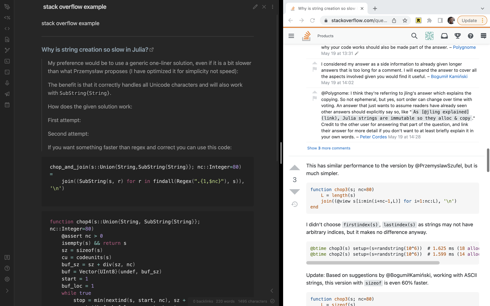
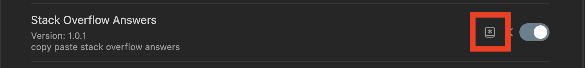
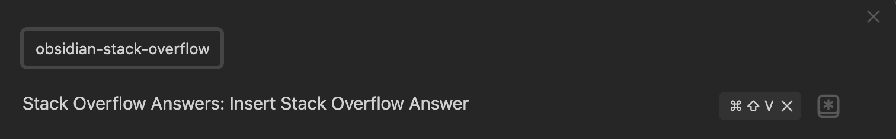

# Watch This video to See The Plugin in Action (Click the Thumbnail)

# Installation

Search `Stack Overflow Answers` in the Obsidian Community Plugins section

## Manual Installation

Clone this folder into your obsidian `.plugins` folder, then:

1) run `npm i` or `yarn` to install dependencies.
2) run `npm run dev` to start compilation in watch mode.

# Usage

The default hotkey to insert a Stack Overflow answer is `cmd+shift+v`. This can be changed in the `community plugins` section.

